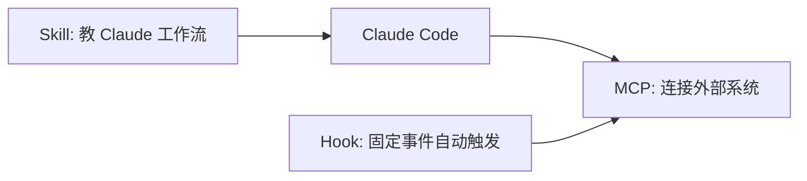

Skills 和 Hooks 都是在扩展 Claude Code，但它们解决的问题完全不同：

- **Skills** 让 Claude Code 在需要时加载一段可复用知识或工作流。
- **Hooks** 在固定事件发生时自动执行脚本、HTTP 请求、MCP 工具、提示词或 agent。

一句话记忆：**Skill 是“教 Claude 怎么做”；Hook 是“到点自动做”。**

## Skills

**Skills** 是把常用工作流、领域知识、团队规范或参考资料打包成可复用文件的方式。例如：

- `/release`：按团队发布流程生成 checklist、检查版本号、整理 changelog。
- `api-conventions`：记录本项目 API 命名、错误格式、分页规范。
- `debug-playbook`：告诉 Claude Code 排查线上问题时先看日志、再看指标、最后改代码。

Claude Code 可以在你手动输入 `/<skill-name>` 时加载 Skill，也可以根据 Skill 的描述自动判断是否需要加载。

## Skill 放在哪里？

| 位置 | 作用范围 |
|------|----------|
| `~/.claude/skills/<skill-name>/SKILL.md` | 你的所有项目 |
| `.claude/skills/<skill-name>/SKILL.md` | 当前项目 |
| 插件中的 `skills/<skill-name>/SKILL.md` | 启用该插件的地方 |

一个 Skill 最小可以长这样：

```markdown
---
name: api-conventions
description: 本项目 API 设计、错误格式和分页约定
---

写 API 相关代码时：

- 路由使用 REST 风格命名
- 错误响应保持统一结构
- 列表接口必须支持分页
```

Frontmatter 里的 `description` 很重要，因为 Claude Code 会用它判断什么时候该加载这个 Skill。对于只想手动触发的任务型 Skill，可以配置 `disable-model-invocation: true`，避免 Claude 自动调用。

## 什么时候写 Skill？

| 你遇到的问题 | 适合放哪里 |
|--------------|------------|
| 每个会话都必须知道的项目规则 | `CLAUDE.md` |
| 偶尔才用、但内容很多的参考资料 | Skill |
| 可复用的多步骤任务 | Skill |
| 必须强制执行的安全限制 | Hook 或权限配置 |
| 需要连接外部系统 | MCP |

适合写 Skill 的信号是：你发现自己经常把同一段流程、规范、模板、排查方法复制给 Claude Code。此时把它变成 Skill，比继续把提示词越写越长更稳。

## 写好 Skill 的方法

1. **名字具体**：`release-checklist` 比 `helper` 更容易理解。
2. **描述写触发条件**：说明“什么时候用”，不要只写“这是一个 Skill”。
3. **正文写操作标准**：列出步骤、输入、输出、禁止事项和质量标准。
4. **把大资料拆出去**：长文档、模板、示例可以放在 Skill 目录下的支持文件里，让正文只保留导航。
5. **从一次真实任务倒推**：先记录你手动指导 Claude Code 的过程，再整理成 Skill。

## Hooks

**Hooks** 是 Claude Code 生命周期里的自动化钩子。它不靠 Claude “记得去做”，而是在某个事件发生时稳定触发。

常见用途：

- 在 Claude Code 写文件后自动运行 formatter 或 linter。
- 在 Bash 工具执行前拦截危险命令。
- 会话结束时写审计日志或发送通知。
- 文件修改后调用安全扫描脚本。

常见事件包括：

| 事件 | 典型用途 |
|------|----------|
| `SessionStart` | 会话开始时加载环境信息 |
| `UserPromptSubmit` | 用户提交提示词前做检查 |
| `UserPromptExpansion` | 斜杠命令展开前检查或补充上下文 |
| `PreToolUse` | 工具执行前拦截或审批 |
| `PermissionRequest` | 权限弹窗出现时记录或决策 |
| `PostToolUse` | 工具执行后运行 lint、测试、扫描 |
| `PostToolUseFailure` | 工具失败后记录或补救 |
| `Stop` / `SessionEnd` | 回合或会话结束时通知、记录日志 |

Hooks 通常写在 settings 配置里。它可以是 shell command、HTTP endpoint、MCP tool、prompt 或 agent。第一次配置时建议从“只记录日志”或“只跑 lint”这种低风险动作开始，不要一开始就写会修改文件或调用生产系统的 Hook。

## Skill 与 Hook 怎么选？

| 判断问题 | 选 Skill | 选 Hook |
|----------|----------|---------|
| 需要 Claude 理解上下文并灵活应用吗？ | 是 | 否 |
| 需要每次事件发生都强制执行吗？ | 否 | 是 |
| 内容主要是知识、规范、流程吗？ | 是 | 否 |
| 动作主要是脚本、检查、通知、阻断吗？ | 否 | 是 |
| 结果是否允许有一定变化？ | 可以 | 尽量确定 |

例子：

- “写 PR 描述时按这个模板组织内容”适合 Skill。
- “每次修改 `.env` 前都必须阻断”适合 Hook 或权限规则。
- “发布前按 checklist 检查版本、测试、迁移、回滚计划”适合 Skill。
- “每次编辑后自动跑 `pnpm lint` 并把结果返回给 Claude”适合 Hook。

## 与 MCP 的组合

Skills、Hooks、MCP 经常一起用：



一个成熟例子：

1. MCP 连接 Sentry，让 Claude Code 能查询错误。
2. Skill 记录团队排查线上问题的步骤和术语。
3. Hook 在会话结束时把排查摘要发到团队频道。

这样三者各司其职：MCP 提供能力，Skill 提供方法，Hook 提供自动化和约束。

## 学习顺序建议

1. **先熟练 `CLAUDE.md`**：把每次都要遵守的项目规则写进去。
2. **把重复提示词整理成 Skill**：从一个真实工作流开始，例如 PR 描述、发布流程、Debug checklist。
3. **观察 Skill 是否触发稳定**：必要时改 `description`，让触发条件更清楚。
4. **再配置低风险 Hook**：例如编辑后运行 lint、会话结束发通知。
5. **最后接 MCP**：当 Skill 或 Hook 需要访问外部系统时，再接入 MCP。

## 入门练习

如果你想真正学会，而不是只看概念，可以按这个顺序做：

1. 找一段你经常复制给 Claude Code 的提示词。
2. 把它改成 `.claude/skills/<name>/SKILL.md`。
3. 在新会话里用 `/<name>` 手动触发一次。
4. 修改 `description`，测试 Claude Code 能否在合适场景自动使用。
5. 配一个只输出日志的 Hook，观察它在什么事件触发。
6. 再把 Hook 改成一个有用但低风险的动作，比如编辑后跑 lint。

## 常见误区

- **把所有内容都塞进 `CLAUDE.md`**：会增加每次请求的上下文负担；偶尔才用的内容更适合 Skill。
- **用 Skill 做强制约束**：Skill 是指导，不是保证。必须强制执行的规则应放到 Hook、权限或 CI。
- **Hook 做得太重**：每次工具调用都触发慢脚本，会让会话变卡。
- **Skill 描述太模糊**：Claude Code 不知道什么时候该加载，就会错过它。
- **没有从真实任务提炼**：凭空写的 Skill 容易像说明书，真实任务沉淀出来的 Skill 更可用。

import OfficialLink from '../../../components/OfficialLink.astro';

<OfficialLink href="https://code.claude.com/docs/en/skills" label="官方 Skills 文档" />

<OfficialLink href="https://code.claude.com/docs/en/hooks-guide" label="官方 Hooks 指南" />
