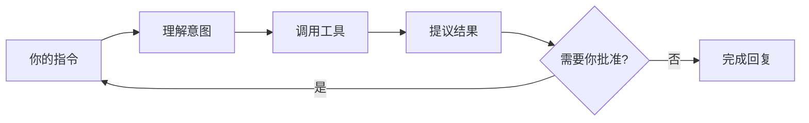

理解 Claude Code 的「Agent 循环」，能帮你更好预判它会做什么、何时会停下来问你。

<figure class="doc-figure">
  
  <figcaption>Claude Code 更像一个受控循环：它可以读项目、调用工具和提出改动，但关键操作仍由你确认。</figcaption>
</figure>

## 简化流程

1. **你描述目标**（自然语言）
2. **Claude 规划步骤**，必要时用工具读文件、搜索、运行命令
3. **敏感操作前暂停**（改文件、执行 Bash 等），等你批准
4. **循环**直到任务完成或你中断

## 内置工具（概念）

| 工具 | 作用 |
|------|------|
| Read | 读取文件 |
| Edit / Write | 修改或创建文件 |
| Bash | 运行 shell 命令 |
| Grep / Glob | 搜索代码库 |
| WebFetch 等 | 按配置获取外部信息 |

具体工具集随版本更新，以官方文档为准。

## 为什么总要我点批准？

这是**安全设计**：防止 AI 误删文件、跑危险命令。你可以在设置中调整权限策略，但新手建议保持默认谨慎模式。

## 下一步

- [工具与权限](/zh-cn/concepts/tools-and-permissions/)
- [上下文与 CLAUDE.md](/zh-cn/concepts/context/)

import OfficialLink from '../../../../components/OfficialLink.astro';

<OfficialLink href="https://code.claude.com/docs/en/how-it-works" />
