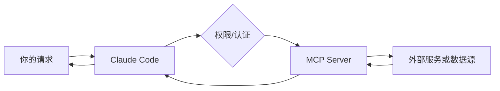

**MCP（Model Context Protocol）** 可以理解为「给 Claude Code 接外设的协议」。Claude Code 本身已经会读文件、搜索代码、运行命令；当你希望它访问数据库、Issue tracker、监控系统、内部 API、浏览器或 SaaS 工具时，就可以通过 MCP Server 暴露一组新的工具。

学 MCP 的关键不是先背配置项，而是先分清三件事：

1. **Claude Code**：负责理解你的目标，并决定何时调用工具。
2. **MCP Server**：负责把外部系统包装成 Claude Code 能调用的工具。
3. **权限与认证**：负责决定 Claude Code 能不能真的访问这些工具，以及访问到什么范围。

## 何时需要 MCP？

| 场景 | 是否需要 |
|------|----------|
| 只改本地代码库 | 通常不需要 |
| 调用项目里的脚本或测试命令 | 通常用 Bash 就够了 |
| 查公司内网 API / 数据库 | 往往需要 MCP |
| 集成 Jira、Notion、Sentry、GitHub、Slack 等服务 | 推荐 MCP |
| 想把团队自己的系统接入 Claude Code | MCP 是标准做法 |

一个实用判断：**如果 Claude Code 需要“到外部系统拿数据或执行动作”，优先考虑 MCP；如果只是告诉它团队规则，优先考虑 `CLAUDE.md` 或 Skills。**

## 基本概念



- **Transport**：Claude Code 和 MCP Server 怎么通信。常见有远程 HTTP、旧的 SSE、本地 stdio。
- **Tool**：MCP Server 暴露给 Claude Code 的一个能力，例如 `query_database`、`create_issue`、`search_docs`。
- **Scope**：配置生效范围。常见有当前项目、本机用户、插件或组织托管配置。
- **Auth**：认证方式。远程服务通常需要 OAuth、Token 或请求头；本地服务可能需要环境变量。

## 常见配置入口

你不需要一开始就会写完整 JSON。更推荐先用命令添加，再查看生成的配置。

```bash
# 查看已配置的 MCP Server
claude mcp list

# 查看某个 Server 详情
claude mcp get <name>

# 在 Claude Code 里检查连接与认证状态
/mcp
```

添加远程 HTTP Server 的形态通常是：

```bash
claude mcp add --transport http <name> <url>
```

添加本地 stdio Server 的形态通常是：

```bash
claude mcp add --transport stdio <name> -- <command> [args...]
```

如果是团队共享配置，通常会写到项目根目录的 `.mcp.json`；如果只是你个人使用，通常保存在用户级配置里。涉及密钥时，尽量用 OAuth、系统钥匙串、环境变量或本地私有配置，不要把明文 Token 提交到仓库。

## 学习路线

1. **先连一个低风险服务**：例如官方示例、只读文档搜索、测试数据库，而不是一上来连接生产库。
2. **学会查看工具列表**：用 `/mcp` 看 Server 是否连上、是否需要认证、暴露了哪些能力。
3. **用自然语言调用一次**：例如“查一下最近 24 小时 Sentry 里最多的错误”，观察 Claude Code 会调用哪个 MCP 工具。
4. **限制权限范围**：优先使用只读账号、细粒度 Token、测试环境和最小权限。
5. **再考虑团队化**：把可共享的 Server 配置放进 `.mcp.json`，把本机密钥留在环境变量或个人配置中。

## MCP 与 Skills 的区别

| 维度 | MCP | Skills |
|------|-----|--------|
| 解决什么问题 | 连接外部工具、数据和服务 | 封装知识、流程和写作/操作规范 |
| 是否执行外部动作 | 可以 | 本身不连接外部系统 |
| 典型例子 | 查询数据库、创建 Jira Issue、读取 Sentry 错误 | 发布 checklist、代码评审准则、团队 API 规范 |
| 最佳组合 | MCP 提供能力 | Skill 教 Claude 怎么用这些能力 |

例如：MCP 让 Claude Code 能查数据库；Skill 则告诉它“订单表、用户表、退款表分别怎么关联，查询生产库时只能用只读语句”。

## 常见误区

- **把 MCP 当成提示词**：MCP 不是“告诉 Claude 规则”，而是“给 Claude 新工具”。
- **一开始就接生产系统**：先用只读权限和测试环境验证调用行为。
- **把密钥写进仓库**：团队共享配置可以提交，但个人 Token、数据库密码不要提交。
- **忽略工具命名**：Server 和工具名要清晰，否则 Claude 很难稳定选择正确工具。
- **没有配合文档**：复杂业务系统最好同时写 `CLAUDE.md` 或 Skill，说明数据模型、约束和安全边界。

## 入门练习

完成下面几个动作，就算真正入门了：

1. 运行 `claude mcp list`，确认当前有哪些 Server。
2. 在 Claude Code 里运行 `/mcp`，查看连接状态。
3. 添加一个只读或测试用途的 Server。
4. 让 Claude Code 调用它完成一个低风险任务。
5. 记录：这个 Server 暴露了哪些工具？需要什么认证？适合项目级还是个人级？

## 下一步

- 阅读 [官方 MCP 文档](https://code.claude.com/docs/en/mcp)
- 阅读 [扩展能力总览](https://code.claude.com/docs/en/features-overview)，理解 MCP、Skills、Hooks、插件分别解决什么问题
- 浏览 [精选文章 · MCP](/zh-cn/resources/)

import OfficialLink from '../../../../components/OfficialLink.astro';

<OfficialLink href="https://code.claude.com/docs/en/mcp" />
